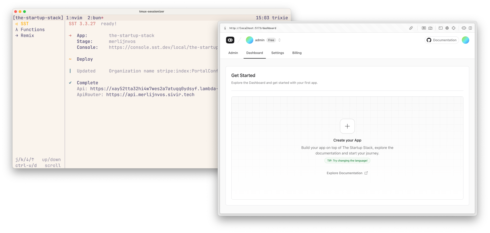

# The Startup Stack

Get independence from expensive SaaS without loosing its developer experience,
the infra primitives to adapt to any future requirement, and the tools to build
delightful, secure user experiences.

## Contents

- [Features](#features)
  - [Planned](#planned)
- [What is this?](#what-is-this)
  - [Infrastructure](#infrastructure)
  - [Backend](#backend)
  - [Frontend](#frontend)
- [When should I use this?](#when-should-i-use-this)
- [Setup](#setup)
- [Use](#use)
- [Acknowledgments](#acknowledgments)
- [License](#license)

## Features

- **[Remix][]** as the full-stack **[React][]** framework.
- **[SST][]** for infrastructure as code on AWS and Cloudflare.
- **[Hono][]** API on [AWS Lambda][].
- **[Postgres][]** database through **[Neon][]**.
- **[Drizzle ORM][]** as the headless TypeScript ORM.
- **[Stripe][]** for subscription plans, customer portal, and more.
- **[Bun][]** for fast local development.
- **[Biome][]** for fast linting and formatting.
- **[shadcn][]** React components.
- **[Tailwind CSS][]** utility CSS Framework.
- **[React Email][]**, customizable emails with React.
- **[Conform][]**, type-safe form validation based on web fundamentals.
- **[Zod][]**, type-safe runtime schema validation.
- **Authentication** through email code, magic link and social logins.
- **Easy Theming**, switch between light and dark modes with ease.
- **Client & Server Toasts**, display toasts on your app.
- **CSRF and Honeypot Protection**, prevent malicious attacks.
- **I18N**, support multiple languages in your app.
- **GitHub Actions** for CI/CD Workflows.

### Planned

- Postgres Row-Level Security (see [Drizzle](https://orm.drizzle.team/docs/rls)
  and [Neon](https://neon.tech/docs/guides/neon-authorize) docs).
- File uploads to S3 and served over Cloudfront.
- The new SST authentication component when it comes out.
- Tailwind [v4.0](https://tailwindcss.com/blog/tailwindcss-v4-beta) when it
  comes out.

## What is this?

A tech stack where you don’t have to choose between capabilities, convenience,
and price as you grow. A stack in which every tool is chosen because it has
proven itself, not the latest hype, and that those tools have commitment to
long-term stability.

### Infrastructure

The Startup Stack is built on [SST][], an infrastructure tool that strikes the
perfect balance between developer convenience and long-term flexibility. In the
article
[“The Cloud Hasn't Been Won Yet”](https://olivergilan.com/blog/cloud-hasnt-been-won/),
Oliver Gilan sees it for what it is: most Platform as a Service (PaaS) solutions
fall into a trap – they're either too simple and limiting (or expensive) for
growing teams or too complex from the start. SST solves this by providing a
powerful Infrastructure as Code (IaC) approach that adapts to your project's
evolving needs. With SST, you get:

- **Flexible Complexity**: Start with simple, one-line configurations for common
  services, but have the full power to dive into granular infrastructure details
  when needed. As your startup grows, your infrastructure can seamlessly grow
  with you.

- **Type-Safe Configurations**.

- **Multi-Cloud Compatibility**: Easily deploy across AWS and Cloudflare, with
  the potential to expand to other providers. Take a second to appreciate how
  cool it is that your
  [Stripe products are defined in code](https://github.com/Murderlon/the-startup-stack/blob/main/infra/stripe.ts)
  or with a one-line change you can combine two different providers:

```diff
export const www = new sst.aws.Remix('Remix', {
  domain: {
    name: domain,
+   dns: sst.cloudflare.dns(),
  }
}
```

The entire stack is serverless and in TypeScript. Serverless is powerful because
it abstracts away infrastructure management, allowing developers to focus solely
on building and deploying code, which accelerates development cycles. It also
automatically scales to handle varying workloads, ensuring cost-efficiency and
optimal performance without manual intervention.

Every developer has its own
[personal isolated stage](https://sst.dev/docs/workflow#with-a-team), including
your `main` and `dev` branches.

Prefer servers and containers?
[Just change ten lines of SST code](https://sst.dev/docs/examples/#aws-remix-container-with-redis).

### Backend

Building on the ideas of SST, where you can adapt to changing requirements, is
the decision to use [Postgres][]. No matter what data requirements may surface,
you can rest assured that Postgres will be able to handle it, either directly or
through an [extension](https://neon.tech/docs/extensions/pg-extensions).

_Why [Neon][] instead of
[Postgres on AWS with SST](https://sst.dev/docs/component/aws/postgres), you may
ask?_

An exception is made as the developer experience of Neon still beats Postgres on
AWS, mainly because of features such as [branching](https://neon.tech/flow), and
the fact that you start for free and scale-to-zero while on AWS you pay per
hour. Neon is built on top of AWS and is available in the AWS marketplace so you
still only have a single bill to pay.

Interfacing with your database through an ORM or not remains a debated topic.
That’s why [Drizzle][Drizzle ORM], the headless ORM, is chosen:

> Other ORMs and data frameworks tend to deviate/abstract you away from SQL,
> which leads to a double learning curve: needing to know both SQL and the
> framework’s API. Drizzle is the opposite. We embrace SQL and built Drizzle to
> be SQL-like at its core, so you can have zero to no learning curve and access
> to the full power of SQL. —
> [Why SQL-like?](https://orm.drizzle.team/docs/overview#why-sql-like)

This template also includes a public facing API on [AWS Lambda][] with [Hono][],
which also handles the Stripe webhooks. Hono allows you to compose an incredibly
powerful developer experience with
[`@hono/zod-openapi`](https://hono.dev/examples/zod-openapi), in which you can
validate values and types using [Zod][] and generate OpenAPI Swagger
documentation.

At the same time, you can use [Hono RPC](https://hono.dev/docs/guides/rpc) next
to it to consume your API on the Remix server or client completely type-safe.
Note that for most UI data and actions you can just use Remix loaders and
actions without going to your API.

### Frontend

The frontend is built with [Remix][], a full-stack [React][] framework that
prioritizes web standards and delivers long-term stability for modern web
applications. Remix’s commitment to working with the browser means you can
leverage fundamental web features like form submissions, progressive
enhancement, and caching out of the box.

Whether you're deploying to traditional Node.js servers, serverless environments
like AWS Lambda, or cutting-edge edge runtimes like Cloudflare Workers, Remix
runs seamlessly. This flexibility lets you adapt to infrastructure changes
without rewriting your frontend logic.

With Remix, the rug is not pulled out from under you to chase innovation (not
pointing fingers 👀). Instead, you get incremental
[future flags](https://remix.run/docs/en/main/guides/api-development-strategy).

Meanwhile you build interfaces rapidly with [shadcn][] and [Tailwind CSS][],
which let’s be honest, they don’t need a pitch anymore at this point.

## When should I use this?

For startups (or side projects) that prefer long-term stability and flexibility
when requirements change.

This template is not designed to be the quickest to set up to play with.

## Setup

### Prerequisites

- [Bun](https://bun.sh).
- Checkout the repository.
- `bun install` to install the dependencies.

### AWS

SST requires an [AWS][] account.

The easiest way is to use your personal root user account to try things out. If
you are going to run this stack under an AWS Organization, checkout the SST docs
on how to [setup your AWS account](https://sst.dev/docs/aws-accounts).

When you’re done, read the
[SST credentials docs](https://sst.dev/docs/iam-credentials) and put your
credentials in `~/.aws/credentials`.

### Domain

A domain registered with
[Cloudflare](https://www.cloudflare.com/products/registrar/),
[AWS Route 53](https://aws.amazon.com/route53/), or
[Vercel](https://vercel.com).

See the [SST docs on custom domains](https://sst.dev/docs/custom-domains) for
more information.

#### No domain (for now)

Just kicking the tires? You can skip this setting up a domain for now.

> [!WARNING] 
> Having no domain configured means emails and Stripe payments won’t
> work and you can only use the admin account from the initial database seed.

1. Comment out all the code in `infra/email.ts` and all its references (in
   `link`).
2. Remove the `domain` configurations from `infra/index.ts`, `infra/stripe.ts`,
   and `infra/api.ts`:

```diff
- domain: {
-   name: domain,
-   dns: sst.cloudflare.dns(),
- },
```

### Neon

1. Get an account on [Neon](https://neon.tech) and create a Postgres database.
2. Add your connection string:

```sh
bunx sst secret add DATABASE_URL your-connection-string
```

Run the following commands in this order:

```sh
# Push the latest migration to Neon (already in the repository)
bun run db:push
# Seed the database
bun run db:seed
```

Whenever you make changes to the database schema you should run:

```sh
bun run db:migrate
```

### Stripe

In order to use Stripe Subscriptions and seed our database, we need to get the
secret keys from our Stripe Dashboard.

1. Create a [Stripe Account](https://dashboard.stripe.com/login) or use an
   existing one.
2. Visit [API Keys](https://dashboard.stripe.com/test/apikeys) section and copy
   the `Publishable` and `Secret` keys.
3. Copy `.env.example` to `.env` if you haven’t yet.
4. Put the secret in there as `STRIPE_API_KEY`.

We put it in `.env` because this secret is needed at build time too.

Both values are also needed at runtime:

```sh
bunx sst secret add STRIPE_PUBLIC_KEY your-key
bunx sst secret add STRIPE_SECRET_KEY your-secret
```

### Secrets

Lastly, there are some other secrets we need to configure:

```sh
# Secures cookies and session data.
bunx sst secret add SESSION_SECRET openssl rand -base64 32
# Encrypts one-time passwords (OTP)
bunx sst secret add ENCRYPTION_SECRET openssl rand -base64 32
# Secures honeypot values in forms.
bunx sst secret add HONEYPOT_ENCRYPTION_SEED openssl rand -base64 32
```

## Use

### Authentication

The following methods are supported:

- Email/Code
- Magic Links
- Social Logins (Github)

Under the hood, we are using `remix-auth`, `remix-auth-totp` and
`remix-auth-github` to handle the authentication process.

In order to speed up development, the OTP code will also be displayed in the
terminal/console, so you don't have to constantly check the email inbox.
(Recommended for development purposes only.)

You can authenticate as `admin` by using the following credentials:

- Email: `admin@admin.com`
- Code: OTP Code is provided by the terminal/console, as email is not sent to
  the `admin` user.

### Subscriptions

The following subscription features are included:

- Subscription Plans
- Subscription Checkout
- Subscription Management (via Stripe Customer Portal)
- Subscription Webhooks

You can test Subscriptions in by using the following Stripe test cards:

- `4242 4242 4242 4242` (Visa)
- `5555 5555 5555 4444` (Mastercard)

### Internationalization

Translations are done via `remix-i18next`, a library from
[`@sergiodxa`](https://github.com/sergiodxa) that integrates `i18next` with
Remix. You can learn more about `remix-i18next` by checking the
[official documentation](https://github.com/sergiodxa/remix-i18next).

Usage is as simple as it can be, as everything is already set up for you.

- Check `/modules/i18n` in order to customize the languages you want to support.
- Add/Edit the translations in the `locales` folder.
- Use the `useTranslation` hook in your components to translate your content.

### Hooks

- `useDoubleCheck`: A hook to confirm user actions, like deleting a record.
  (Original Source: [Epic Stack](github.com/epicweb-dev/epic-stack))
- `useInterval`: A hook to run a function at a specified interval.
- `useNonce`: A hook to generate a nonce value.
- `useRequestInfo`: A hook that returns the request information from the `root`
  loader.
- `useTheme`: A hook to manage the application theme.

### Toasts

- `getToastSession`: A utility to get the toast session.
- `createToastHeaders`: A utility to create toast headers.
- `redirectWithToast`: A utility to redirect with a toast message.

## Acknowledgments

- [remix-saas](https://github.com/dev-xo/remix-saas) for most of the Remix
  boiler plate and some of the docs.
- [terminaldotshop](https://github.com/terminaldotshop/terminal) for SST and
  other code patterns.

## License

[MIT](https://github.com/Murderlon/the-startup-stack/blob/master/license) ©
[Merlijn Vos](https://github.com/Murderlon)

<!-- Definitions -->

[Remix]: https://remix.run
[React]: https://react.dev
[SST]: https://sst.dev
[Postgres]: https://postgresql.org
[Neon]: https://neon.tech
[Drizzle ORM]: https://orm.drizzle.team
[Stripe]: https://stripe.com
[shadcn]: https://ui.shadcn.com
[Tailwind CSS]: https://tailwindcss.com
[React Email]: https://react.email
[Conform]: https://conform.guide
[Hono]: https://hono.dev
[AWS Lambda]: https://aws.amazon.com/lambda
[Zod]: https://zod.dev
[AWS]: https://aws.amazon.com
[Bun]: https://bun.sh
[Biome]: https://biomejs.dev
